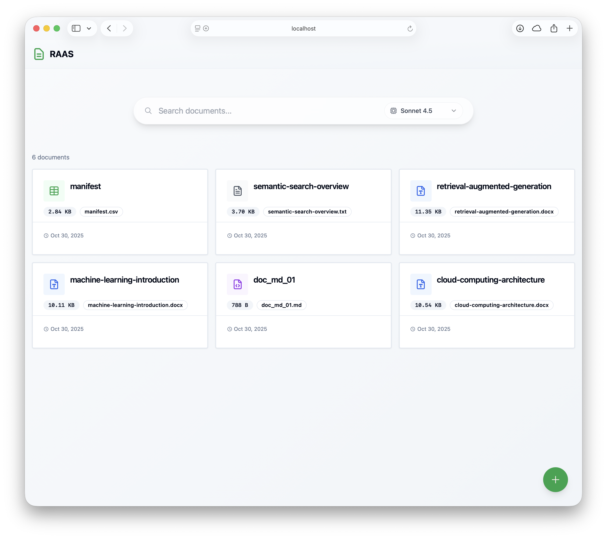
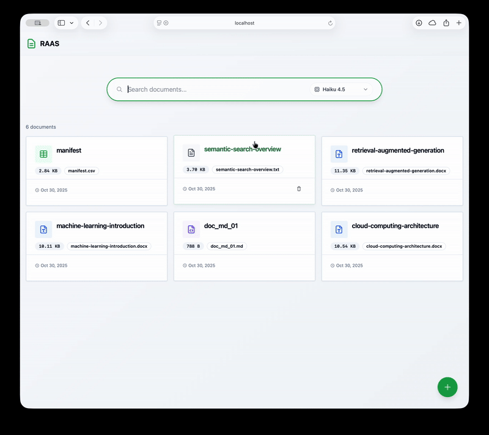

# RAaS – Retrieval-Augmented Generation as a Service

> Search your documents using natural language and get AI-powered answers with sources


[](https://www.python.org/)
[](https://fastapi.tiangolo.com/)
[](https://react.dev/)
[](https://www.typescriptlang.org/)
[](LICENSE)

## Table of Contents

- [Overview](#overview)
- [Demo](#demo)
- [Key Features](#key-features)
- [Architecture](#architecture)
- [Tech Stack](#tech-stack)
- [Quick Start](#quick-start)
- [Development](#development)
- [Kubernetes Deployment](#kubernetes-deployment)
- [API Reference](#api-reference)
- [Configuration](#configuration)
- [Troubleshooting](#troubleshooting)
- [Contributing](#contributing)
- [License](#license)
- [Contact](#contact--links)

## Overview

RAaS lets you upload documents and search them using natural language questions. Instead of just keyword matching, it understands what you're actually asking. Search for "contract breach" and it'll find mentions of "agreement violation."

The platform generates AI summaries with inline citations showing exactly where each piece of information came from. It's built as separate microservices so the heavy lifting (embeddings, AI generation) can scale without affecting the rest of the system.

## Demo


*Main page showing search bar and document list*


*Real-time document search and answer generation*

### Key Features

- **Semantic Search** – Understands meaning, not just keywords
- **Hybrid Retrieval** – Combines vector similarity with keyword matching (using Reciprocal Rank Fusion)
- **AI Summarisation** – Generates contextual answers with inline citations. Works with OpenAI, Anthropic, or Google models
- **Multi-Format Support** – Handles PDFs, DOCX, TXT, CSV, and Markdown
- **Cross-Encoder Reranking** – Re-scores the top results to surface the most relevant chunks
- **Kubernetes Ready** – Auto-scaling, health checks, and rolling updates included

---

## Architecture

```
        ┌──────────┐
        │ Frontend │ :3000
        └─────┬────┘
              │
        ┌─────▼─────┐
        │    API    │  ←─ Gateway & Orchestration
        │   :8000   │
        └─────┬─────┘
              │
    ┌─────────┼─────────┬──────────┐
    │         │         │          │
┌───▼────┐ ┌─▼────┐ ┌──▼─────-┐ ┌──▼──────┐
│Embedder│ │Search│ │Generator│ │Postgres │
│ :8001  │ │:8003 │ │ :8002   │ │ :5432   │
└───┬────┘ └─┬────┘ └─────────┘ └─────────┘
    │        │
    │   ┌────▼────┐
    └───► Qdrant  │
        │  :6333  │  ←─ Vector Database
        └─────────┘
```

### Microservices

| Service | Responsibility | Tech Stack |
|---------|----------------|------------|
| **API Gateway** | Handles requests, document storage, business logic | FastAPI, SQLAlchemy, PostgreSQL |
| **Search** | Hybrid search (vector + keyword) and reranking | FastAPI, Qdrant, sentence-transformers |
| **Embedder** | Converts text to 384-dimensional vectors | sentence-transformers (all-MiniLM-L6-v2) |
| **Generator** | Creates AI summaries with citations | OpenAI/Anthropic/Google APIs |
| **Frontend** | Real-time search interface | React 18, TypeScript, Tailwind CSS, shadcn/ui |

### Infrastructure

- **PostgreSQL** – Stores document metadata and text chunks
- **Qdrant** – Vector database using HNSW indexing for fast similarity search
- **Docker Compose** – For local development
- **Kubernetes** – Production deployment (includes horizontal pod autoscaling)

---

## Tech Stack

**Backend:**
- Python 3.13 with async/await patterns
- FastAPI 0.119 for high-performance APIs
- SQLAlchemy 2.0 with asyncpg
- Pydantic v2 for data validation
- sentence-transformers for embeddings
- Qdrant vector database

**Frontend:**
- React 18 with TypeScript
- Vite for fast builds
- React Query for server state
- Tailwind CSS + shadcn/ui components
- Radix UI primitives

**Infrastructure:**
- Docker 24.0+ with multi-stage builds
- Kubernetes with Kustomize
- NGINX Ingress Controller
- Horizontal Pod Autoscaler (HPA)
- Persistent Volumes for stateful services

---

## Quick Start

### Prerequisites

- Docker and Docker Compose OR Kubernetes cluster (kind, minikube, etc.)
- OpenAI API key (required) - [Get one here](https://platform.openai.com/api-keys)
- Anthropic API key (optional) - [Get one here](https://console.anthropic.com/)
- Google API key (optional) - [Get one here](https://makersuite.google.com/app/apikey)

### 1. Configure API Keys

Choose one of the following methods:

#### Option A: Automated Setup (Recommended)

Run the interactive setup script:

```bash
./scripts/setup-secrets.sh
```

The script will:
- Ask for your API keys and validate them
- Create a `.env` file for Docker Compose
- Create `infrastructure/k8s/base/generator/secret.yaml` for Kubernetes
- Show clear error messages if any keys are invalid

#### Option B: Manual Setup

**For Docker Compose:**

```bash
cp .env.template .env
# Edit .env and replace placeholder values with your actual API keys
```

**For Kubernetes:**

```bash
cp infrastructure/k8s/base/generator/secret.yaml.template infrastructure/k8s/base/generator/secret.yaml
# Edit secret.yaml and replace placeholder values with your actual API keys
```

### 2. Start the Services

#### Docker Compose

```bash
docker-compose -f infrastructure/docker-compose/docker-compose.yml up -d
```

Verify services are running:
```bash
docker-compose -f infrastructure/docker-compose/docker-compose.yml ps
docker-compose -f infrastructure/docker-compose/docker-compose.yml logs generator  # Should show no errors
```

Access the application:
- Frontend: http://localhost:3000
- API: http://localhost:8000
- Generator: http://localhost:8002

#### Kubernetes (using kind)

```bash
# Create cluster if needed
./infrastructure/scripts/setup-kind-full.sh

# Apply configurations
kubectl apply -f infrastructure/k8s/base/generator/secret.yaml
kubectl apply -k infrastructure/k8s/overlays/local/

# Wait for services to be ready
kubectl wait --for=condition=ready pod -l app=generator -n raas --timeout=300s
```

Access the application:
```bash
kubectl port-forward -n raas svc/frontend 3000:3000
kubectl port-forward -n raas svc/api 8000:8000
```

### 3. Verify Installation

Test the health endpoint:

**Docker Compose:**
```bash
curl http://localhost:8002/api/v1/health
```

**Kubernetes:**
```bash
kubectl exec -n raas deploy/generator -- curl localhost:8002/api/v1/health
```

Expected response:
```json
{"status": "healthy"}
```

### 4. Upload a Document and Search

```bash
# Upload a document
curl -X POST http://localhost:8000/api/v1/documents/upload \
  -F "file=@example.pdf" \
  -F "title=Example Document"

# Search for relevant chunks
curl -X POST http://localhost:8000/api/v1/search \
  -H "Content-Type: application/json" \
  -d '{
    "query": "What are the key findings?",
    "top_k": 10
  }'
```

### Troubleshooting Quick Start

**"OPENAI_API_KEY is required" error:**
- Run `./scripts/setup-secrets.sh` to set up your API keys
- Or check that your `.env` file has a valid OpenAI key

**Generator service won't start:**
- Check the logs: `docker-compose -f infrastructure/docker-compose/docker-compose.yml logs generator` or `kubectl logs -n raas deploy/generator`
- Make sure your API key format is correct (should start with `sk-proj-` or `sk-`)
- Verify the `.env` file exists and can be read

**Services timing out:**
- The first startup takes 2-5 minutes because it downloads ML models
- Check if you have enough resources: `docker stats` or `kubectl top nodes`

---

## Development

### Local Development Setup

```bash
# Backend (API service)
cd services/api
poetry install
poetry run uvicorn app.main:app --reload --port 8000

# Frontend
cd services/frontend
npm install
npm run dev  # Runs on http://localhost:3000
```

### Running Tests

```bash
# Unit tests per service
cd services/api && poetry run pytest
cd services/embedder && poetry run pytest
cd services/generator && poetry run pytest
cd services/search && poetry run pytest
cd services/frontend && npm test

# Integration test (full workflow)
./tests/integration/test_full_workflow.sh
```

### Code Quality

```bash
# Type checking
cd services/api && poetry run mypy app/

# Linting
cd services/api && poetry run ruff check app/

# Frontend type checking
cd services/frontend && npx tsc --noEmit
```

---

## Kubernetes Deployment

Deploy to a local Kubernetes cluster using [kind](https://kind.sigs.k8s.io/):

```bash
# Automated setup (creates cluster, builds images, deploys)
./infrastructure/scripts/setup-kind-full.sh

# Access services
kubectl port-forward svc/frontend 3000:80 -n raas
kubectl port-forward svc/api 8000:8000 -n raas
```

### Manual Deployment

```bash
# Create kind cluster
kind create cluster --config infrastructure/kind/kind-config.yaml

# Build and load images
docker build -t raas-api:latest -f services/api/Dockerfile services/api
kind load docker-image raas-api:latest

# Deploy with Kustomize
kubectl apply -k infrastructure/k8s/overlays/local/

# Verify deployment
kubectl get pods -n raas
kubectl logs -f deployment/api -n raas
```

See [infrastructure/k8s/README.md](infrastructure/k8s/README.md) for production deployment instructions.

---

## API Reference

### Core Endpoints

| Method | Endpoint | Description |
|--------|----------|-------------|
| `POST` | `/api/v1/documents/upload` | Upload PDF/DOCX/TXT/CSV/MD file |
| `GET` | `/api/v1/documents` | List all documents |
| `GET` | `/api/v1/documents/{id}` | Get document details |
| `DELETE` | `/api/v1/documents/{id}` | Delete document and vectors |
| `POST` | `/api/v1/search` | Hybrid semantic search returning chunks |
| `POST` | `/api/v1/generate/summary` | Generate AI summary from chunk IDs |
| `GET` | `/api/v1/models` | List available LLM models |
| `GET` | `/api/v1/health` | Health check endpoint |

### Example 1: Search for Relevant Chunks

```bash
curl -X POST http://localhost:8000/api/v1/search \
  -H "Content-Type: application/json" \
  -d '{
    "query": "What is machine learning?",
    "top_k": 10
  }'
```

Response:
```json
{
  "query": "What is machine learning?",
  "results": [
    {
      "chunk_id": "660e8400-e29b-41d4-a716-446655440111",
      "document_id": "550e8400-e29b-41d4-a716-446655440000",
      "content": "Machine learning is a subset of AI that enables computers to learn from data...",
      "score": 0.89,
      "tokens": 512
    }
  ],
  "total_results": 42
}
```

### Example 2: Generate AI Summary from Chunks

```bash
curl -X POST http://localhost:8000/api/v1/generate/summary \
  -H "Content-Type: application/json" \
  -d '{
    "query": "What is machine learning?",
    "chunk_ids": ["660e8400-e29b-41d4-a716-446655440111", "660e8400-e29b-41d4-a716-446655440222"],
    "model": "gpt-5-mini"
  }'
```

Response:
```json
{
  "summary": "Machine learning is an AI approach that enables computers to learn from data without explicit programming [1]. It includes techniques like supervised learning for labeled datasets [2].",
  "model_used": "gpt-5-mini"
}
```

---

## Configuration

### Environment Variables

| Variable | Required | Default | Description |
|----------|----------|---------|-------------|
| `OPENAI_API_KEY` | Yes | - | OpenAI API key for GPT models |
| `ANTHROPIC_API_KEY` | No | - | Anthropic API key for Claude models |
| `GOOGLE_API_KEY` | No | - | Google API key for Gemini models |
| `DEFAULT_MODEL` | No | `gpt-5-mini` | Default model for summaries |
| `DATABASE_URL` | No | Auto-generated | PostgreSQL connection string |
| `QDRANT_URL` | No | `http://qdrant:6333` | Qdrant vector database URL |

### Generator Service Configuration

| Variable | Required | Default | Description |
|----------|----------|---------|-------------|
| `ENABLE_OPENAI` | No | `true` | Enable OpenAI provider |
| `ENABLE_ANTHROPIC` | No | `false` | Enable Anthropic provider |
| `ENABLE_GOOGLE` | No | `false` | Enable Google provider |
| `MAX_CHUNKS` | No | `5` | Maximum chunks for generation context |
| `TEMPERATURE` | No | `0.1` | LLM temperature (0.0-1.0) |
| `MAX_TOKENS` | No | `2000` | Maximum tokens in generated response |
| `TIMEOUT` | No | `30` | API request timeout in seconds |

See individual service `.env.example` files for complete configuration options.

---

## Project Structure

```
raas/
├── services/
│   ├── api/              # FastAPI gateway service
│   │   ├── app/
│   │   │   ├── api/      # Route handlers
│   │   │   ├── domain/   # Business logic
│   │   │   ├── models/   # SQLAlchemy models
│   │   │   └── repositories/  # Data access layer
│   │   ├── tests/
│   │   └── pyproject.toml
│   ├── embedder/         # Vector generation service
│   ├── generator/        # LLM summarisation service
│   ├── search/           # Hybrid search service
│   └── frontend/         # React SPA
│       ├── src/
│       │   ├── components/
│       │   ├── hooks/
│       │   └── services/
│       └── package.json
├── infrastructure/
│   ├── docker-compose/   # Local development
│   │   ├── docker-compose.yml
│   │   └── .env.example
│   ├── k8s/              # Kubernetes manifests
│   │   ├── base/
│   │   └── overlays/
│   ├── kind/             # Local Kubernetes setup
│   └── scripts/
└── tests/
    └── integration/
```

---

## Extending the Platform

### Adding a New LLM Provider

1. Create a provider class in `services/generator/app/providers/`:

```python
from app.providers.base import ModelProvider

class MyProvider(ModelProvider):
    async def generate(self, prompt: str, **kwargs) -> str:
        # Implementation here
        pass
```

2. Register in `services/generator/app/main.py`:

```python
from app.providers.my_provider import MyProvider

providers = {
    "my-provider": MyProvider(api_key=os.getenv("MY_PROVIDER_API_KEY"))
}
```

3. Add credentials to `.env`:

```bash
MY_PROVIDER_API_KEY=your-key-here
```

See [services/generator/README.md](services/generator/README.md) for detailed examples.

---

## Performance & Scaling

### Benchmarks

- **Search latency**: Under 100ms for hybrid search (95th percentile)
- **Embedding generation**: About 50ms per 512-token chunk
- **AI summary generation**: 2-5 seconds (depends on the model and provider)
- **Throughput**: Handles 100+ concurrent searches with autoscaling enabled

### Horizontal Pod Autoscaler

The Kubernetes deployment scales services up and down based on CPU and memory usage:

```yaml
# Example HPA configuration
minReplicas: 2
maxReplicas: 5
targetCPUUtilizationPercentage: 70
targetMemoryUtilizationPercentage: 80
```

---

## Troubleshooting

### Services won't start

```bash
# Check logs
docker-compose -f infrastructure/docker-compose/docker-compose.yml logs -f

# Restart individual service
docker-compose -f infrastructure/docker-compose/docker-compose.yml restart api
```

### No search results

```bash
# Verify documents were uploaded
curl http://localhost:8000/api/v1/documents | jq

# Check Qdrant collection
curl http://localhost:6333/collections/documents | jq '.result'
```

### Database connection issues

```bash
# Access PostgreSQL
docker exec -it raas-postgres psql -U raasuser -d raasdb

# List tables
\dt

# Check documents
SELECT id, title, status FROM documents;
```

### Kubernetes pod crashes

```bash
# Check pod status
kubectl get pods -n raas

# View logs
kubectl logs -f deployment/api -n raas

# Describe pod for events
kubectl describe pod <pod-name> -n raas
```

---

## How It Works

### Search Pipeline

1. **Query Embedding** – Your search gets converted to a 384-dimensional vector
2. **Hybrid Retrieval** – Runs vector search (Qdrant) and keyword search (PostgreSQL) at the same time
3. **RRF Fusion** – Merges both result sets using Reciprocal Rank Fusion
4. **Cross-Encoder Reranking** – Scores the top results for relevance
5. **AI Summarisation** – Generates an answer with inline citations

### Design Choices

- **Microservices** – The expensive operations (embeddings, AI) can scale separately
- **Async I/O** – Handles many concurrent requests without waiting
- **Repository Pattern** – Keeps data access code separate from business logic
- **Type Safety** – Pydantic and TypeScript catch type errors before runtime

---

## Testing

The project has 47 test files covering all services:

- Unit tests using pytest (Python) and Jest (TypeScript)
- Integration tests for the full upload-search-generate workflow
- Type checking with mypy in strict mode
- Code linting with Ruff and ESLint

```bash
# Run all tests
./tests/integration/test_full_workflow.sh

# Run with coverage report
cd services/api && poetry run pytest --cov=app --cov-report=html
```

---

## Contributing

This started as a portfolio and academic project, but contributions are welcome! Bug fixes, documentation improvements, and educational enhancements are all appreciated.

Check out [CONTRIBUTING.md](CONTRIBUTING.md) for detailed guidelines.

### Quick Start for Contributors

1. Fork the repo
2. Create a feature branch: `git checkout -b feature/my-feature`
3. Make your changes and write tests
4. Run the tests: `poetry run pytest` (backend) or `npm test` (frontend)
5. Commit your changes: `git commit -am 'feat: add my feature'`
6. Push to your branch: `git push origin feature/my-feature`
7. Open a Pull Request

---

## License

MIT License - See [LICENSE](LICENSE) for details.

---

## Contact & Links

**Author:** Michael Blauberg

**Email:** mblauberg@outlook.com

**LinkedIn:** [linkedin.com/in/mblauberg](https://linkedin.com/in/mblauberg)

**Project Links:**
- [Report Issues](../../issues)
- [Security Policy](SECURITY.md)
- [Contributing Guidelines](CONTRIBUTING.md)

---

## Built With

- [FastAPI](https://fastapi.tiangolo.com/), [React](https://react.dev/), and [Kubernetes](https://kubernetes.io/)
- [Qdrant](https://qdrant.tech/) for vector search
- [sentence-transformers](https://www.sbert.net/) for embeddings
- [shadcn/ui](https://ui.shadcn.com/) for UI components
